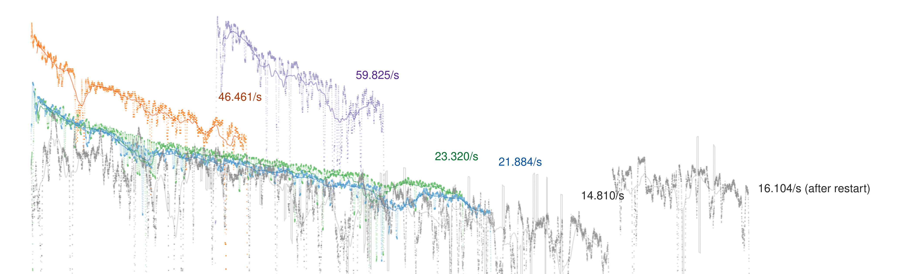

# Multi-client benchmark on Ethereum 2.0 mainnet 2021/01/28

- [x] Lighthouse
- [x] Prysm
- [x] Nimbus
- [x] Teku
- [x] Lodestar

_Work in progress._

### Host systems (4x)
- Machine:
- OS:
- CPU:
- RAM:
- Disk:

### Ethereum 2.0 mainnet
- Spec version: `v1.0.0`
- Circa `420_000` slots start time
- 5 different clients compatible with mainnet spec

##### Lighthouse
- `Lighthouse v1.1.0-e4b6213`
- from git `tags/v1.1.0`
- Rust `1.49.0`, Cargo `1.49.0`
- Built in `--release` mode
    `cargo build --release`

##### Prysm
- `beacon-chain version Prysm/v1.1.0/9b367b36fc12ecf565ad649209aa2b5bba8c7797. Built at: 2021-01-18 19:47:14+00:00`
- from binary release `v1.1.0`
    `./prysm.sh beacon-chain`

##### Teku
- `teku/v21.1.1/linux-x86_64/oracle_openjdk-java-11`
- from git `tags/21.1.1`
- Java `11.0.10`, Gradle `6.8.1`
- Built in dist mode
    `./gradlew installDist`

##### Nimbus
- `Nimbus beacon node v1.0.6-87955f2d-stateofus`
- from git `tags/v1.0.6`
- Nim `1.2.6`, Make `4.3.0`
- Built in `-d:release -d:insecure` mode
    `NIMFLAGS="-d:insecure -d:release" make -j $(nproc) nimbus_beacon_node`

##### Lodestar
- `lodestar 0.14.0`
- from git `tags/v0.14.0`
- Node `12.20.1`, Lerna `3.22.1`
- Built in default mode
    `lerna bootstrap`

### Metrics collected
- `unix`: unix time of data in seconds
- `time`: time since client start in seconds
- `slot`: current client slot as number
- `sps`: slots per second as reported by client in seconds^{-1} (lighthouse only)
- `db`: database size in bytes
- `pc`: connected peer count as number
- `out`: outgoing network traffic by beacon node process in bytes (via `nethogs`)
- `inc`: incoming network traffic by beacon node process in bytes (via `nethogs`)
- `cpu`: average `%user` cpu usage over last second of host system in percent (via `mpstat`)
