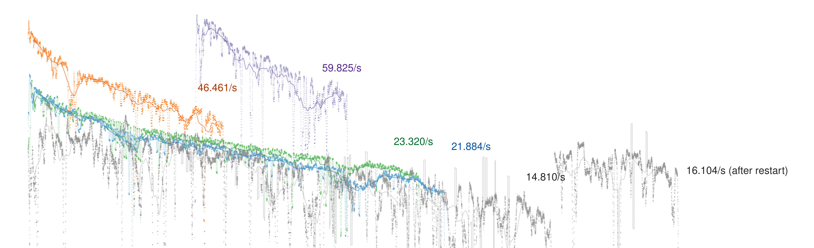

# Ethereum 2.0 Mainnet - All Clients Compared

After the [Ethereum 2.0 mainnet launch](https://www.coindesk.com/ethereum-2-0-beacon-chain-goes-live-as-world-computer-begins-long-awaited-overhaul) of the beacon chain in December 2020, it is just about time to introduce and compare the existing protocol implementations. The first part of this mini-series of articles, will compare the beacon node performance and resource utilization of the five main clients, in alphabetical order:
* **[Lighthouse](https://github.com/sigp/lighthouse)** (Rust, Sigma Prime)
* **[Lodestar](https://github.com/ChainSafe/lodestar)** (TypeScript, ChainSafe Systems)
* **[Nimbus](https://github.com/status-im/nimbus-eth2)** (Nim, Status)
* **[Prysm](https://github.com/prysmaticlabs/prysm)** (Go, Prysmatic Labs)
* **[Teku](https://github.com/ConsenSys/teku)** (Java, ConsenSys Quorum)

The Ethereum 2.0 mainnet infrastructure consists of three major components:
* The **beacon chain** is a proof-of-stake blockchain. In future, this will be the backbone of keeping Ethereum secure once the merge of the legacy proof-of-work Ethereum 1.x chain is concluded.
* The **validators** are the _miners_ in proof-of-stake. By locking 32 ETH, [everyone can stake their Ether](https://ethereum.org/en/eth2/staking/), propose new blocks, vote on finality, and obtain rewards.
* The **slashers** are monitoring the validators for their correct behavior to prevent attacks. In case any validator breaks the rules, they will be penalized and removed from the network.

Notably, in this article, we focus on the first component, the _beacon chain_ as this is the foundation for all other components in Ethereum 2. Before diving into the different clients and metrics, it shall be noted that all relevant scripts, data, plots, and benchmarking meta-data [can be found on Github](https://github.com/byz-f/eth2-bench-mainnet) for further analysis and this article focuses on explaining the findings.

### Synchronization Metrics
The first and potentially most interesting question is, how long does it take to synchronize the Ethereum 2.0 beacon-chain. Well, here's the results.

Here, you can read the synchronization progress in slot number over time of the client running. Before nominating a winner, which is not the scope of this article anyways, there are three things to know about this chart.
1. Prysm (purple) does something unique that the other clients do not do anymore: It connects to an Ethereum 1.x node, fetches all Ether deposits from the validator registry, and builds the Eth2 genesis from the Eth1 state. While this is a good feature from a security perspective as you do not have to trust the Prysm developers to give you the correct genesis state, this obviously takes time and therefore, there is a clearly visible offset between client start and synchronization start ([#8209](https://github.com/prysmaticlabs/prysm/issues/8209)).
2. Lodestar (gray) crashed during the benchmark due to an JavaScript heap out-of-memory issue ([#2005](https://github.com/ChainSafe/lodestar/issues/2005)). However, it was automatically restarted by the scripts after 10 seconds.
3. Not visible: Lodestar does not yet fully validate all signatures on initial sync ([#1217](https://github.com/ChainSafe/lodestar/issues/1217)). Therefore, it is not clear how the Lodestar graph compares to the others.

Given this chart, Lighthouse (orange) shows an outstanding overall "out-of-the-box" performance with Prysm, Teku (green), and Nimbus (blue) doing a good job at keeping up. But, let's also take a look at this.

In this chart, we removed the time offset between launching the client and the first beacon chain block seen by the client during synchronization. Now you can see, that Prysm actually beats Lighthouse in pure synchronization speed slightly, requiring a little less than two hours, where Lighthouse requires two and a half hours. Teku and Nimbus still showing good performance with roughly five hours required.

Notably, and to be fair with the Lodestar team, the strength of the Eth2 TypeScript implementation is not being the go-to client for running a full beacon-chain or validator node but rather providing the infrasturcture for all web, browser, and plugin-based components of Eth2 decentralized applications in future.

Now, given (A) we know the current slot height of the client's beacon head block and (B) we can look up the head it saw 60 seconds ago, we can compute the synchronization speed as moving average over the last 60 seconds displayed at slots per second (dots); a moving average over 10 minutes is displayed as solid line.

The results reflect the previous charts. Prysm, even with the Eth1-state offset, is the fastest client synchronizing 60 slots per second, closely followed by Lighthouse with 46 slots per second. Slightly behind in the field are Teku with 23 and Nimbus with 22 slots per second.

But, what is a slot, you may ask. In traditional blockchains, such as Bitcoin or Eth1, there is either a block, or not. To compute performance of such clients, we would compare the synchronization speed in blocks per second. What's the difference? 

In Ethereum 2.0, there is always an assigned slot scheduled at a fixed interval; here: 12 seconds. If the validator that is assigned to such a slot, proposes a block, we see a block in that slot. However, if a validator misses its slot, the slot will be empty (no block) but the slot count will move on regardless. Therefore, in Eth2, we compare the sync-speed in slots per second.

Let's remove the time component from the chart above and solely focus on synchronization speed mapped over the synchronized slot number. Across all clients, there is a trend visible that sync performance decreases over slot number. As this data was gathered on the Ethereum 2.0 mainnet, we know that there is a [queue of validators](https://eth2-validator-queue.web.app/) waiting to join the network. At the time of writing, 13_458 validators are in the queue which would take almost 15 days to clear at a rate of 900 new validators every day.

So, knowing about the linear growth of the Eth2 mainnet validator count, we can assume that the synchronization speed is negatively impacted by the size of the validator set.

### Computational Resource Metrics

In the previous section, we solely analyzed synchronization metrics for the purpose of finding the _fastest_ client. But which client is not only fast but also _efficient_ in their resource utilization?

Here, the size of the database is compared across the five clients in relation to the synchronized slot number. Notably, Lodestar comes with the smallest footprint totaling only 1.49 GiB for the fully synchronized mainnet node (420_000 slots). Lighthouse (2.98 GiB) and Prysm (3.16 GiB) follow up with good results.

All clients implement database pruning by default. This means, everything that is invalidated by the beacon chain's finality, e.g., is removed ... blah

This is the same chart but plotting the resident memory set size of each client during synchronization. Here, the Nimbus client is highly efficient, requiring only about 1 GiB of RAM during the entire processing of the beacon-chain mainnet. Nimbus is followed by Lighthouse and Lodestar both operating at slightly less than 3 GiB.

It shall be noted that the off-heap memory that Java allocates for Teku is outside of the client developer's control as the JVM is being greedy about available memory. The results of these metrics for Teku vary massively based on the available total memory available.

Last but not least, let's take a look at the CPU utilization.

### FAQ

> _**Nice article but I thought Eth2 is not real?**_
it is (f society meme in genesis)

> _**Nice article but you cannot do anything on Eth2 yet, can you?**_
sure you do, validate, slashing, backbome for consensus

> _**Nice article but why didn't you compare traffic metrics?**_
i actually did, just didn't comment (link)

> _**Which client do you personally recommend?**_
lighthouse, teku, maybe prysm

> _**While I have your attention, will the beacon chain ever be more than 1 TiB?**_
no, because finality

> _**But that's not an full-archival node, isn't it?**_

> _**Haven't you done that before, or anyone else?**_
medalla yes
also baarcelona team

> _**When will you compare validator nodes, slashers, or available APIs?**_
ethcc
